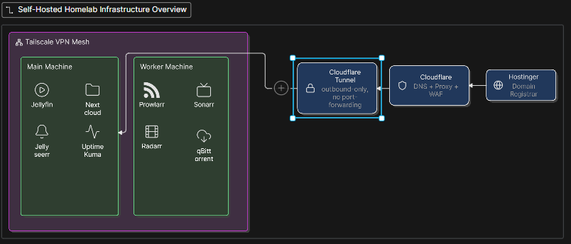

# Self-Hosted Infrastructure

This project documents a self hosted homelab environment used as a real world
demonstration of networking, cloud, and security engineering skills. Rather then a typical tutorial, it's more of a living environment; that's 
actively managed,monitored, and secured.

## Overview
- **Domain registrar:** Hostinger (domain purchased here, DNS migration to Cloudflare)
- **DNS / Edge:**       Cloudflare (proxying, WAF, DNS management, access policies)
- **Tunnel:**           Cloudflare Tunnel (`cloudflared`) — all private services are exposed through the tunnel rather than port-forwarding, so no internal/origin IP is ever exposed, The tunnel also acts as an automated Service where DNS records/Routes are automatically created when an ingressed rule is added.
- **VPN / private mesh:** Tailscale, used for direct private access to internal
  services/machines outside of what's exposed publicly (For instance QBittorrent, which isn't exposed publicly due to being only for administrative usage).

## General Network Infrastructure

See `/diagrams` for the full detailed diagram

## Folder Structure

Folder & Purposes

- **[`configurations/`](./configurations)** — Per-service configuration files/templates (redacted of secrets)
- **[`diagrams/`](./diagrams)** — Architecture diagrams (network flow, service map, tunnel routing)
- **[`documentation/`](./documentation)** — Step-by-step setup, configuration, and maintenance procedures
- **[`screenshots/`](./screenshots)** — Visual proof of working services, dashboards, and monitoring

## Services Hosted

| Service     | Machine | Purpose                                          
|-------------|---------|---------------------------------------------------
| Website     | Main    | Personal/portfolio site on the root domain        
| Jellyfin    | Main    | Self-hosted media streaming server                
| Jellyseerr  | Main    | Media request/management front-end for Jellyfin   
| Nextcloud   | Main    | Private cloud storage/file sync                   
| Uptime Kuma | Main    | Uptime/status monitoring for all services          
| Prowlarr    | Worker  | Indexer manager for media automation setup         
| Sonarr      | Worker  | TV show automation/management                      
| Radarr      | Worker  | Movie automation/management                        
| qBittorrent | Worker  | Download client for the automation setup           
| Tailscale   | Both    | Private VPN mesh for internal only access    

## Security Notes

- No internal IP addresses are ever exposed publicly — all traffic to self-hosted
  services routes through Cloudflare Tunnel, which establishes an outbound-only
  connection from the Main machine.
- Cloudflare WAF/Access rules are used to gate sensitive services (e.g. Nextcloud,
  Uptime Kuma dashboard) behind additional authentication.
- All configuration files in this repo are **redacted templates** — real domains,
  tokens, tunnel IDs, and credentials are never shown.
